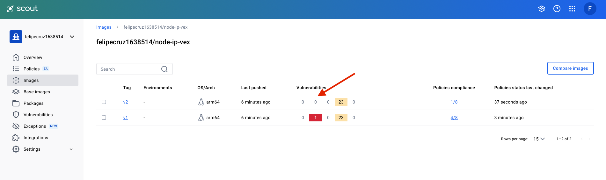
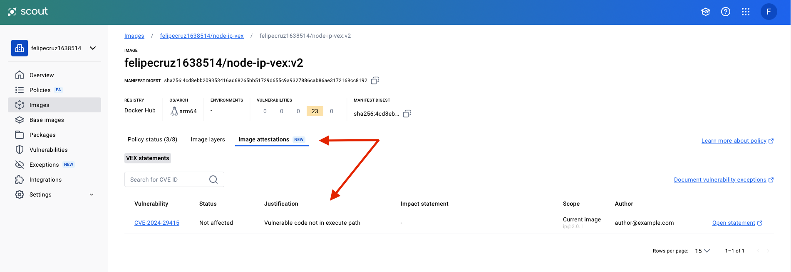

# node-ip-vex

This sample project depends on the [node-ip](https://github.com/indutny/node-ip) npm package which is vulnerable to [CVE-2024-29415](https://github.com/advisories/GHSA-2p57-rm9w-gvfp).

However, because our project does not directly use the vulnerable function `.isPublic()`, it is not exploitable to CVE-2024-29415.

## Run an analysis with Docker Scout

I can package my project as a Docker image:

```bash
docker buildx build -t felipecruz1638514/node-ip-vex:v1 .
```

And run a Docker Scout analysis to check if my project is vulnerable to CVE-2024-29415:

```bash
docker scout cves felipecruz1638514/node-ip-vex:v1 --only-cve-id CVE-2024-29415
    ✓ Image stored for indexing
    ✓ Indexed 221 packages
    ✓ Provenance obtained from attestation
    ✗ Detected 1 vulnerable package with 1 vulnerability


## Overview

                    │           Analyzed Image
────────────────────┼─────────────────────────────────────
  Target            │  felipecruz1638514/node-ip-vex:v1
    digest          │  972354a74233
    platform        │ linux/arm64
    vulnerabilities │    0C     1H     0M     0L
    size            │ 48 MB
    packages        │ 221


## Packages and Vulnerabilities

   0C     1H     0M     0L  ip 2.0.1
pkg:npm/ip@2.0.1

    ✗ HIGH CVE-2024-29415 [Server-Side Request Forgery (SSRF)]
      https://scout.docker.com/v/CVE-2024-29415
      Affected range : <=2.0.1
      Fixed version  : not fixed


1 vulnerability found in 1 package
  LOW       0
  MEDIUM    0
  HIGH      1
  CRITICAL  0
```

The output from this command shows that this CVE affects the npm package `ip@2.0.1` in the image.

## Generate a VEX document

The next step is to generate a VEX document to add context about the fact that just because it contains a vulnerable package - `ip@2.0.1` - it does not mean that the vulnerability is exploitable to CVE-2024-29415.

We can use `vexctl` to create a VEX document:

```bash
vexctl create \
  --author="author@example.com" \
  --product="pkg:docker/felipecruz1638514/node-ip-vex@v2" \
  --subcomponents="pkg:npm/ip@2.0.1" \
  --vuln="CVE-2024-29415" \
  --status="not_affected" \
  --justification="vulnerable_code_not_in_execute_path" \
  --file="CVE-2024-29415.vex.json"
```

## Verify CVE suppression

To test whether the CVE has been suppressed, we can build the image again under a new tag (v2) and copy the VEX statement into the image filesystem. That step is already covered using the `COPY . .` in the existing Dockerfile.

```bash
docker buildx build -t felipecruz1638514/node-ip-vex:v2 .
```

Next, run the Docker Scout analysis again loading the VEX document:

```bash
docker scout cves felipecruz1638514/node-ip-vex:v2 --only-cve-id CVE-2024-29415 --vex-location .
    ✓ Image stored for indexing
    ✓ Indexed 324 packages
    ✓ Loaded 1 VEX document
    ✗ Detected 1 vulnerable package with 1 vulnerability


## Overview

                    │           Analyzed Image            
────────────────────┼─────────────────────────────────────
  Target            │  felipecruz1638514/node-ip-vex:v2   
    digest          │  646daafacd8e                       
    platform        │ linux/arm64                         
    vulnerabilities │    0C     1H     0M     0L          
    size            │ 76 MB                               
    packages        │ 324                                 


## Packages and Vulnerabilities

   0C     1H     0M     0L  ip 2.0.1
pkg:npm/ip@2.0.1

    ✗ HIGH CVE-2024-29415 [Server-Side Request Forgery (SSRF)]
      https://scout.docker.com/v/CVE-2024-29415
      Affected range : <=2.0.1                                             
      Fixed version  : not fixed                                           
      VEX            : not affected [vulnerable code not in execute path]  
                     : author@example.com                                  
    


1 vulnerability found in 1 package
  LOW       0  
  MEDIUM    0  
  HIGH      1  
  CRITICAL  0  
```

Notice in the output above that CVE-2024-29415 has been suppressed:

```
      VEX            : not affected [vulnerable code not in execute path]  
                     : author@example.com                                  
```

Also, you can use the `--only-vex-affected` flag to filter out the suppressed CVE:

```bash
docker scout cves felipecruz1638514/node-ip-vex:v2 --only-cve-id CVE-2024-29415 --vex-location . --only-vex-affected
    ✓ SBOM of image already cached, 324 packages indexed
    ✓ Loaded 1 VEX document
    ✓ No vulnerable package detected


## Overview

                    │           Analyzed Image            
────────────────────┼─────────────────────────────────────
  Target            │  felipecruz1638514/node-ip-vex:v2   
    digest          │  646daafacd8e                       
    platform        │ linux/arm64                         
    vulnerabilities │    0C     0H     0M     0L          
    size            │ 76 MB                               
    packages        │ 324                                 

```


## Inspecting the image in the Docker Scout UI

Finally, let's push the image to Docker Scout (scout.docker.com) and inspect it in the UI:

```bash
docker buildx build --sbom=false --provenance=false -t felipecruz1638514/node-ip-vex:v2 --push .
```

> Note: VEX documents embedded in the image filesystem are not considered for images that have attestations. If your image has any attestations, Docker Scout will only look for exceptions in the attestations, and not in the image filesystem. That's why we disabled the SBOM and provenance in the `docker buildx build` command.

In the Docker Scout website the `v2` tag doesn't show the CVE-2024-29415 vulnerability with HIGH severity anymore as Scout takes into account the VEX document embedded in the image filesystem.



On the image details page, we can see the VEX document that was loaded from the image filesystem:



## Resources

- https://docs.docker.com/scout/explore/exceptions/
- https://docs.docker.com/scout/guides/vex/
